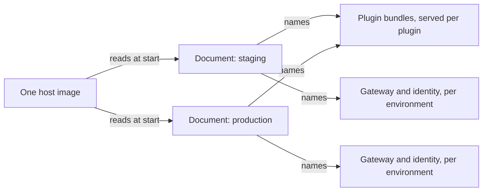

The host is built once. A product is a document naming a product plugin, the plugins to load,
the layouts, the blocks, the flags and the head. Adding a product is a plugin and a document.
Adding an environment is a document.



## The document

```json
{
  "version": "2026.09.08-1",
  "product": "acme",
  "auth": { "url": "https://auth.example/api/auth" },
  "api": { "gateway": "https://api.example/graphql" },
  "theme": "https://plugins.example/acme/theme.css",
  "remotes": {
    "acme": "https://plugins.example/acme",
    "agreements": "https://plugins.example/agreements"
  },
  "locales": { "base": "en", "locales": ["en", "nl"] },
  "plugins": {
    "agreements": { "config": { "retentionDays": 365 } },
    "billing": { "enabled": false, "locked": true }
  },
  "layouts": [{ "id": "default", "arrangement": "sidebar", "options": { "collapsible": "icon" } }],
  "blocks": { "standard/nav.footer": { "disabled": true } },
  "flags": { "agreements.renewalWidget": true },
  "screens": { "agreements.root": { "path": "contracts" } }
}
```

The host validates the document against its own schema and against each loaded plugin's
configuration schema. A document that fails refuses to start the host, because an operator's
mistake is the one nobody inside the product can fix from a screen.

Moving a screen is one line. `"agreements.root": { "path": "contracts" }` moves that screen,
everything under it, and every link and navigation entry pointing at any of them, because a
link carries a reference rather than a path.

## What needs a build, and what does not

| Change                                          | Needs a build                             |
| ----------------------------------------------- | ----------------------------------------- |
| turning a plugin on or off for a deployment     | no                                        |
| moving a screen, or changing a layout's options | no                                        |
| setting a flag or a configuration field         | no                                        |
| pointing an environment at a different gateway  | no                                        |
| adding a product, given plugins that exist      | no                                        |
| changing a plugin's own code                    | yes, that plugin only                     |
| changing the design system or the platform      | yes, and the plugins that ship against it |

A plugin is a build artefact. What the document removes is the rebuild of everything else
when one plugin changes, and the rebuild of anything at all when a deployment changes its
mind.

## Environments

Every environment runs the same host image and the same plugin bundles. What differs is the
document: the origins, which plugins are on, and the values of the configuration fields the
deployment scope owns. Nothing about an environment is compiled in, and no code branches on
an environment's name.

Secrets never appear in a document. The document is public by construction, so a process
reads its own secrets from its environment, and anything a plugin needs per organisation is
kept encrypted by the configuration service instead.
