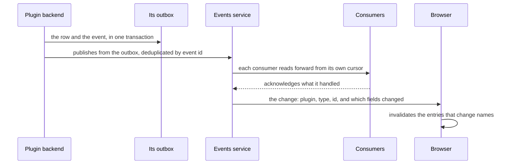

A change and the event about it are one transaction. The backend writes the row and the event
together into its own schema, and a relay in the same process reads that outbox and publishes
to the events service. A change that was written is therefore a change that was announced,
and a change that was rolled back announces nothing.



Delivery is at least once and every consumer is idempotent by event id, so a consumer that
was down reads what it missed rather than losing it. No backend reads another backend's
outbox: the channel belongs to the events service.

What reaches a browser is never the record. It is the plugin, the type, the id, the kind of
change and the names of the fields that changed. The browser refetches under the reader's own
permissions, so a change cannot show anybody a row they may not read.

## When your own service stores the record

There is no shared transaction across a boundary the platform does not control, so a record
your service stores cannot be written and announced as one step. The platform takes changes
from whatever your service offers: a change feed it reads, a webhook it receives, or polling.
Delivery is still at least once and consumers are still idempotent.

A source that offers none of those produces no events, and the declaration says so rather
than pretending. Nothing that depends on events works for that entity: no live updates, no
automations triggered by a change, and no index the platform keeps current.

## Jobs

A job is a function in the backend that owns it, run by that backend's own queue with
retries, a deadline and progress. A schedule is a row the queue runs, and a schedule that
runs per organisation keeps one row per organisation in that organisation's timezone. No
scheduler process exists, because a row and a poll do the work.

The queue publishes a job's state as events like any other change, so the progress a person
watches, the toast when it finishes and the schedules page all read entities rather than
another backend's queue table.

## Automations

An automation is a trigger, conditions and actions, composed by an administrator from a
screen. It writes no new declarations: the events, their payloads, the entities, the commands
and their arguments are already declared, and the builder offers exactly those.

```ts
interface Automation {
  id: string
  name: string
  enabled: boolean
  /** An event a plugin declared, a schedule in the organisation's timezone, or a manual run. */
  trigger: { event: string } | { manual: true } | { schedule: string }
  /** Paths into the trigger's payload, compared with a value. */
  conditions: Condition[]
  /** A command with its arguments, a notification, or a procedure on a connector. */
  actions: Action[]
  /** Whose permissions bound every action, at the moment the automation was saved. */
  grantedBy: string
}
```

A condition reads a path in the payload, and follows a reference to a record once. It does not
follow a second, because each one is another fetch on every matching event and another
permission check the administrator cannot see. A question that needs two is a field on the
entity, or a rule a developer writes and somebody reviews.

An action runs the same way a person's click runs. A command runs its mutation, a notification
goes through the notifications service, and a procedure goes through the connector the
organisation configured.

### What stops an automation harming anything

- **The bound.** Every action runs under a token limited to the intersection of the granting
  administrator's permissions and what the action needs. The platform re-checks the grant
  before each run, and pauses the automation with a reason when it no longer holds.
- **The loop guard.** Every call carries the chain of what caused it, so an event an action
  produced names the automation that produced it. A chain deeper than five is refused.
- **The budget.** Runs per organisation are capped per minute, and an automation that fails
  three times in a row pauses with its last error.
- **The record.** Every run is an entity holding the trigger, how each condition evaluated,
  each action and its result, so an administrator reads why an automation fired and why it did
  not.
