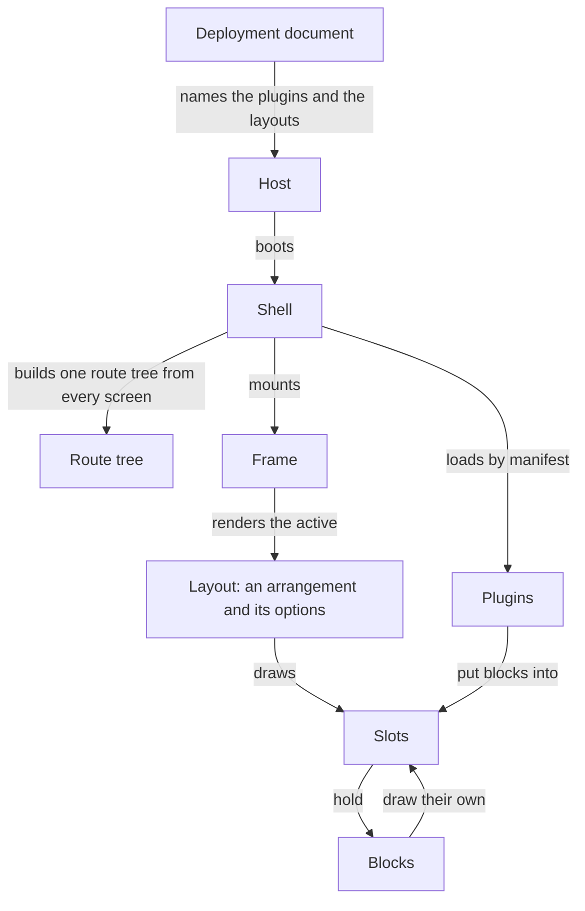

A product is a deployment document, a product plugin and the plugins the document names.
The platform supplies everything else, and the platform is built once.

The host is one image. It reads its document at start, fetches the plugins the document
names, and mounts the shell. Nothing about a product is compiled into the host, so one image
runs every product in every environment.

## What runs in the browser

The host boots the shell. The shell loads each plugin by its manifest, builds one route tree
from every plugin's screens, and mounts the frame. The frame renders the active layout,
which is an arrangement and its options. The layout draws its slots. A plugin puts blocks
into those slots, and a block that renders draws slots of its own.

The registry behind this is flat. Every slot carries one id, and every block names the slot
it goes into, so a block in a slot a screen draws costs what a block in a layout slot costs
and the shell finds both the same way.

## Who decides what

| Decided by         | What                                                                        |
| ------------------ | --------------------------------------------------------------------------- |
| the platform       | the host image, the shell, the frame, the arrangements, the standard chrome |
| a plugin           | its screens, its blocks, its entities, and the contract it exposes          |
| the product plugin | the brand, the arrangements it registers, and the theme                     |
| the deployment     | which plugins load, where they mount, the layouts, the blocks, the flags    |
| an organisation    | everything the document leaves unlocked, written from the settings area     |
| a person           | the fields a plugin scopes to them                                          |

A plugin never imports another plugin. What a plugin offers the rest is its contract: typed
references to its slots, apis, screens, queries, entities, streams, flags, permissions,
configuration and subjects. A plugin built in another repository targets those references
with types.

## The boot order

1. The host fetches the document.
2. The host links the theme stylesheet the document names, and waits for it, so nothing
   renders unthemed.
3. The host fetches the session.
4. The shell reads the organisation's settings.
5. The shell fetches the manifest of every plugin whose rules pass.
6. The shell registers the arrangements, the layouts, the blocks and the apis.
7. The shell builds the route tree.
8. The host mounts.

A plugin whose rule fails is never fetched. A plugin the document disables, or whose
configuration fails its own schema, is left out whole and reported, because a plugin that
half works is worse than a plugin that is missing.

## The route decides the page

The shell derives one context per navigation. That context carries the route, the session,
the organisation and the subjects the screens on the branch declared themselves to be about.
The shell compiles every rule once and hands the same context to every block, so a block
drawn on every page knows which page it is on and what that page shows.

A slot re-renders only when its own list of blocks changes. A rule names which parts of the
context it reads, so a navigation that changes nothing a slot's rules read is not an
evaluation of that slot.

[Declaring an entity](entities.md) says what one declaration gives a plugin.
[The request path](requests.md) says how a screen reaches a row.
