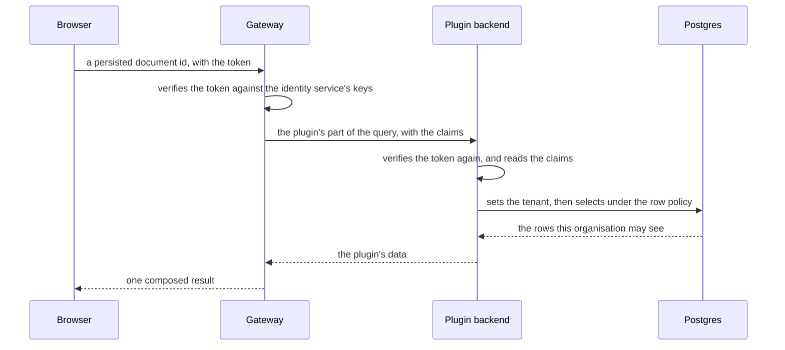

Every request a screen makes goes to one GraphQL gateway, which runs only the queries the
product shipped. Behind it runs one backend for each plugin that has data, and beside those
the services every backend uses.

The gateway does not resolve a field itself. It composes one schema from every plugin's part
and from any GraphQL API you already run, works out which backend answers which part of a
query, and puts the results together.

## A read

The router loads a screen's data before the screen renders, through one shared query client,
and preloads on intent, so the cache is warm before the click. Two screens that need the same
record fetch it once.

## A write

A mutation carries an idempotency key, so a retry cannot apply twice, and the version the
browser read, so a lost update is refused rather than winning silently. The backend validates
the input against the entity's schema, runs the rule, then writes the row and the event in one
transaction. The browser invalidates the entries the mutation changed and offers an undo.

A refusal comes back as a code and a list of field issues, each with a path and a stable
identifier. The form puts each issue at its field and translates it from the code.

## What speaks to what

| From        | To           | Over                         | For                                              |
| ----------- | ------------ | ---------------------------- | ------------------------------------------------ |
| a browser   | the gateway  | GraphQL, persisted documents | every read and write a screen makes              |
| a browser   | identity     | HTTP on its own origin       | signing in, and the token                        |
| a browser   | object store | HTTP on a presigned URL      | uploading and downloading a file                 |
| the gateway | a backend    | GraphQL, with the claims     | the part of a query that backend owns            |
| a backend   | a service    | Connect over protobuf        | identity, configuration, and publishing an event |
| a backend   | the gateway  | GraphQL, its own documents   | another plugin's data, outside a resolver        |
| a backend   | its own rows | SQL, in its own schema       | everything it stores                             |
| a backend   | your service | Connect, gRPC or HTTP        | a record your company already stores             |
| a connector | a vendor     | the vendor's protocol        | the one place a vendor's API is called           |

Connect never reaches a browser, and no backend reads another backend's tables. A backend
that needs another plugin's data asks the graph, so every caller goes through one API, one
list of allowed queries and one set of permission checks.

## Persisted documents only

Every web bundle publishes the operations it contains, and the gateway resolves a document id
against that list. The browser never sends a query string, which removes the attack surface a
public GraphQL endpoint otherwise carries, and it makes the gateway's cache keys stable.

## What arrives in pieces

A model's reply, a build log and a job's progress are streams. A plugin declares a stream with
its arguments and its chunk, the backend serves it, and the browser accumulates the chunks
into one query's data. Everything true of a query stays true of a stream, including the
loader, invalidation and the devtools.

## What tells a browser that data changed

Every browser holds one subscription, and it carries changes for every plugin: the plugin,
the type, the id, the kind of change and the names of the fields that changed. It never
carries the record. The browser invalidates the entries a change names and refetches them
under the reader's own permissions. One subscription serves a page whatever it shows.

[Identity and permissions](identity.md) says what the token carries and who checks it.
