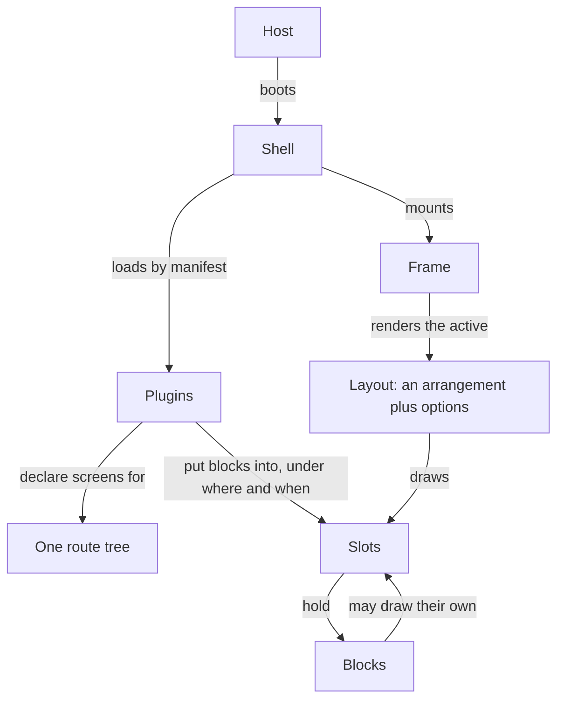
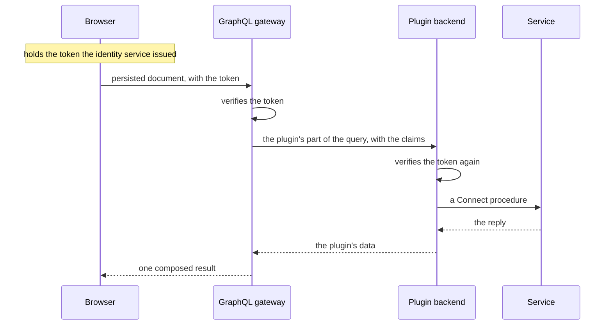

A product is a deployment document, a product plugin and a handful of plugins. Everything
else belongs to the platform. This page gives the shape; the platform's RFCs hold the
argument and the interfaces.

## In the browser

A **host** boots the **shell**. The shell loads **plugins** by their **manifests**, builds one
route tree from their **screens**, and mounts a **frame**. The frame renders the active
**layout**, which is configuration, an arrangement plus options, and draws its **slots**.
Plugins put **blocks** into slots: typed metadata, a lazily loaded module, a place before,
after, around or instead of what the slot already holds, and the rules under which it shows,
**where** over the route and **when** over flags, session and permissions. Any block that
renders can draw slots of its own.

The route decides everything on screen. The shell derives one **context** per navigation,
the route, the session, the organisation and the **subjects** the screens on the branch
declare themselves to be about, compiles every rule once, and hands the same context to every
block. A screen's data is loaded by the router before the screen renders, through one shared
query client.

A plugin never imports another plugin, and the host never imports a plugin. What a plugin
exposes to the rest is its **contract**: references to its slots, apis, screens, queries,
entities, streams, flags, permissions, configuration and subjects, so a plugin built
elsewhere targets them with types.

## Behind the door

One **GraphQL gateway** stands in front of every product, and the browser speaks GraphQL to
it and nothing else, with persisted documents only. Behind it, one **backend** per plugin that
has data to show: a process that hosts the plugin's subgraph, its domain rules, the entities
it declared, its job handlers and its webhooks. A backend is built on the platform's core
services, database, entities, events, jobs, streams, configuration, identity, telemetry and
the rest, and reaches a service or another backend over Connect.

The identity service issues a short-lived token once. The gateway verifies it and forwards
it as claims, and every backend verifies it again, so no hop trusts the one before it.

Everything a person, a plugin or a vendor hands the platform is declared once as a schema
and checked at every boundary with that declaration.

## What a plugin author writes

An **entity** declared once in the contract becomes a table, its procedures, its GraphQL,
its events, its search, its subject and its screens. A **stream** is a query whose data grows.
A screen is three lines naming the entity, the layout and the place. Everything a person
reads is a key in a catalogue, rendered in that person's locale, including a manifest's
titles.

## A product

The host is built once. A product is a **product plugin**, its brand, the arrangements it
registers, its theme and its own screens if any, plus a **deployment document** naming that
plugin, the plugins it loads, its layouts, its blocks, its flags and its head. Adding a
product is a plugin and a document, not a build; the document is read at start, so one
artifact runs in every environment and nothing about an environment is compiled in.

**Automations** are what an administrator composes without a developer: a trigger, an event a
plugin declared, a schedule or a manual run; conditions over the payload; actions that are
commands, notifications and connector procedures. Every run is an entity with a log, and
every action an audit record.
