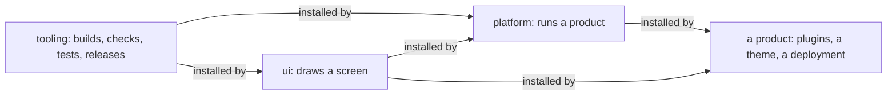

The code is cut by who may see it and who owns it, never by architectural layer. Four
motives decided the cut: parts of the system are open source and parts are not; a change to
one tree should not rebuild the others; different teams own different trees; and the
toolchain, the design system, the platform and a product each change at their own pace.

Nothing points the other way: the toolchain knows no component, the design system knows no
router, and the platform knows no product.

## What each repository holds

| Repository | Visibility | Holds                                                                                                                                                                                                                                                                                        |
| ---------- | ---------- | -------------------------------------------------------------------------------------------------------------------------------------------------------------------------------------------------------------------------------------------------------------------------------------------- |
| `tooling`  | public     | `core/`: what every tier stands on: validation, the environment, locales, logging, results, the appearance and the theme contract. `themes/`: the base theme. `tools/`: the build preset, the `stealth` command, the test helpers, the fixtures, the workspace reader and the Storybook kit. |
| `ui`       | public     | `foundations/`: the theme contract and the hooks. `components/`: the component library and one package per heavy dependency. `catalogue/`.                                                                                                                                                   |
| `platform` | public     | `contracts/`: what a plugin declares. `web/` and `backend/`: the two SDKs and the host. `services/`, `plugins/`, `catalogue/`.                                                                                                                                                               |
| a product  | private    | `plugins/`: what the product adds. `theme/`: a recipe. `e2e/`: the suite that drives the host. `deploy/`: the document and the environments.                                                                                                                                                 |

The directories under a root are the concepts a reader of that repository already has, in
the plural. A package is a leaf under one of them, and its name is that path:
[Repositories and packages](../reference/packages.md) has the rule and the examples.

## Why a module is the default

The monorepo this cut comes from had ninety-three manifests for one system, most of them
carrying a layering rule rather than serving a consumer. Layering is checked by path, so a
package needs one of four reasons to exist: somebody installs it on its own; another
repository takes it at development time; it is deployed as an image or a remote; or it ships
a command. A concern inside a package is a directory with a subpath entry, so
`@stealthscale/web-sdk/router` is one manifest and one version, tree-shaken per entry.

## What crosses between them

**A browser speaks GraphQL, and nothing else.** Every read and write a screen makes goes to
one gateway, which runs only the queries the product shipped. Backends and services speak
Connect over protobuf to each other, and that never reaches a browser. The two protocols are
kept apart because they are asked for different things: a browser needs one query across
several plugins, and a backend needs a typed procedure whose schema is checked before it is
deployed.

**Module federation is the loader.** A plugin's web part is a federated bundle the host
fetches at run time, so a plugin is redeployed without rebuilding the host. One module in the
web SDK knows federation exists, and the deployment document is the only place a remote is
named.

**Words are ICU MessageFormat catalogues, resolved by the platform.** A component speaks keys
through a resolver the root provides; a package ships its keys and their base locale as ICU
data; the platform loads them into its translation chain, and an app outside the platform
loads them into its own.

**An SDK is for building a plugin; functionality is a plugin.** The backend SDK holds what no
backend exists without: the process, the platform, the database, the outbox and the queue, the
cache, keys and tokens, telemetry, the mail transport, rpc. The web SDK holds what no screen
exists without. Everything that does something for a person, from billing to search, is a
plugin, and another plugin reaches it through that plugin's contract.

## What stays the same everywhere

Every repository carries the same `docs/` tree, the same workflows calling the toolchain's,
the same gates, and packages that resolve to their source inside the workspace and to `dist`
outside it. Each repository names its own export condition for that, `tooling-source` in the
toolchain. A condition every repository shared would follow a package to the registry: a
repository that turns it on resolves everything through it, so a published package carrying
the same key would point at a `src` directory the tarball does not ship. A package a
repository installs matches no condition of its own and reads what was packed.
