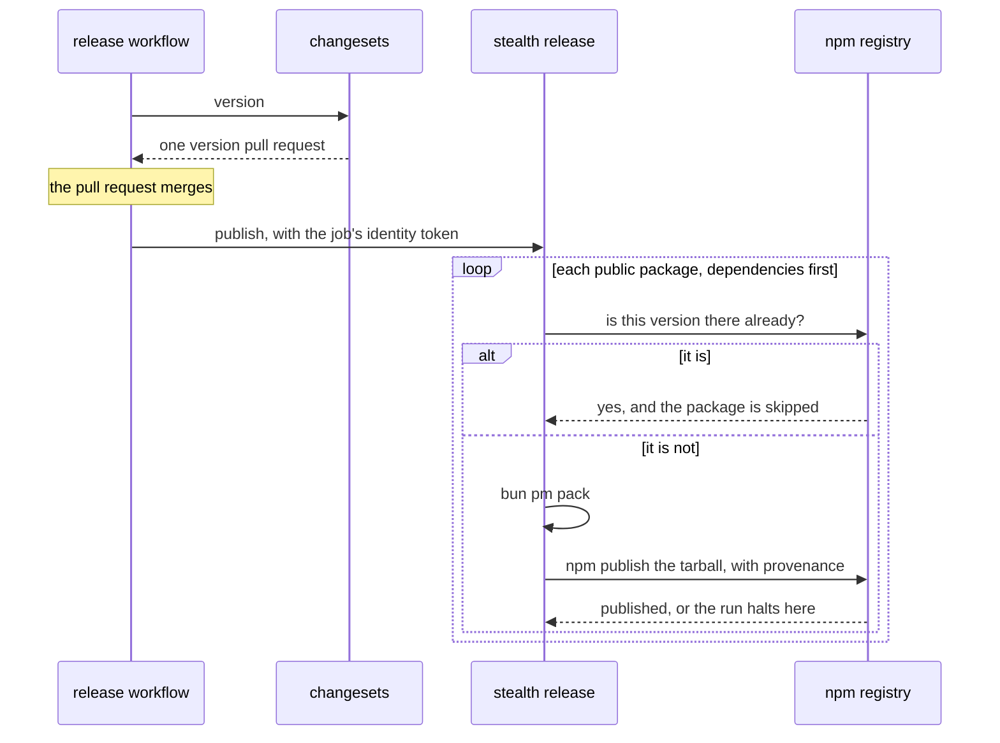

Every repository is checked by one toolchain, configured once at its root through the
preset `@stealthscale/tool-config` provides. What follows is what that configuration
enforces. A package never carries a rule of its own that a root rule already covers.

## The toolchain

| Tool         | Used for                                                                            |
| ------------ | ----------------------------------------------------------------------------------- |
| bun 1.4      | Installing, running scripts, the workspace and the catalog                          |
| Vite+ (`vp`) | `vp check` formats, lints and type-checks; `vp test`; `vp pack`; `vp run` for tasks |
| oxfmt        | Formatting, through `vp fmt`                                                        |
| oxlint       | Linting, type-aware, through `vp lint`                                              |
| TypeScript 7 | The compiler, native; declarations are emitted by tsgo at pack time                 |
| Vitest       | Specs in Node and jsdom, and every story in Chromium                                |
| tsdown       | Packing a library: per-file ESM, declarations, the exports map                      |
| changesets   | Versioning and changelogs                                                           |

`vp check --fix` before a commit; `vp run ci` is what CI runs, and it is the same task on a
developer's machine.

## Formatting

100 columns, single quotes, no semicolons, manifests sorted. The formatter does not wrap
comments or prose: a docblock line and a Markdown line are wrapped by hand at 100 columns.
Generated output is neither formatted nor linted: `dist/`, `coverage/`, `*.gen.*`, and the
declaration file the pack step writes beside a config it reaches.

## Lint

oxlint's `correctness`, `suspicious`, `perf` and `pedantic` categories are errors. The
`typescript`, `unicorn`, `oxc`, `import` and `promise` plugins run everywhere; `react` and
`jsx-a11y` run on the globs a repository says render; Node's rules run on the globs it says
run in Node. Taste is left to the formatter.

Size is a proxy for whether a thing does one thing:

| Limit                 | Value                                                     |
| --------------------- | --------------------------------------------------------- |
| lines per file        | 300, blank lines and comments not counted                 |
| lines per function    | 60; a spec's `describe` and a story's `render` are exempt |
| cyclomatic complexity | 10                                                        |
| nesting depth         | 4                                                         |
| parameters            | 4                                                         |

Beyond oxlint's own rules, two plugins are load-bearing. `eslint-plugin-jsdoc` holds every
declaration, exported or not, to a typed multi-line docblock, as [Docblocks](docblocks.md)
describes. `eslint-plugin-perfectionist` sorts imports, exports, object keys, interface
members, JSX props and union members alphabetically, with a blank line starting a new block,
so a diff shows a change rather than a reordering.

Rules that stand for a security decision:

- `no-script-url`, everywhere: a `javascript:` URL is what `no-eval` and `no-implied-eval`
  do not reach.
- `no-restricted-properties` on `innerHTML`, `outerHTML`, `insertAdjacentHTML` and
  `document.cookie`, `react/jsx-no-target-blank` and `react/no-danger`, where things render:
  markup is rendered, never assigned, and cookies belong to the package that owns
  authentication. A package that has to render untrusted text sanitises first and argues for
  its exception in its own override.
- `no-restricted-imports`, per tier: the root config names each tier, what it may not import
  and why, through `lintConfig({ layers })`. The rule holds for what a package ships; a
  specification may reach for a development-time package whatever tier it sits in.

## Types

`strict`, `noUncheckedIndexedAccess`, `exactOptionalPropertyTypes`, `noImplicitOverride`,
`noImplicitReturns`, `noFallthroughCasesInSwitch`, `noUnusedLocals`, `noUnusedParameters`,
`erasableSyntaxOnly`, `verbatimModuleSyntax`, `isolatedModules`, `allowImportingTsExtensions`,
`moduleDetection: force`; target and lib `es2023`, module `esnext`, resolution `bundler`. The
toolchain ships that base as `@stealthscale/tool-config/tsconfig/base.json`. A repository's
`tsconfig.base.json` extends it and adds one thing, `customConditions` naming the
repository's own source condition; every package extends the repository's base and adds
nothing but its `include`. A package's tsconfig never includes its `vite.config.ts`, or the
declaration build writes files beside the config's imports.

A package is checked against its dependencies' source, not their `dist`: no build sits
between an edit and `vp check`, a spec or a story.

## Tests

A spec sits beside every source, named after it: `thing.ts` and `thing.spec.ts`, a barrel
included. No guard checks the pairing yet; the coverage floor is what fails a source that
nothing exercises.

| Spec            | Runs in  | Because                                                      |
| --------------- | -------- | ------------------------------------------------------------ |
| `*.spec.ts`     | Node     | It renders nothing                                           |
| `*.spec.tsx`    | jsdom    | It renders                                                   |
| `*.stories.tsx` | Chromium | Its play function and its accessibility check need a browser |

Never a `.spec.ts` and a `.spec.tsx` of the same basename beside each other: the type-aware
linter resolves the second without the workspace condition.

Coverage is on by default and the floor is 100% of statements, branches, functions and lines
per file. What sits outside the floor is listed in the root config with the reason beside
each entry: a `bin` that hands its command to a parser and decides nothing, a module
Storybook loads by its default export and nothing outside a catalogue can load. A green
suite is not a review: coverage says a line ran, not that it behaved, so a spec asserts the
outcome a caller sees.

A spec on the real workspace never pins a count or a list of what the tree holds today. It
states the rule and derives the expectation from the tree; a scratch workspace in a temporary
directory may pin, because the spec wrote it. Test data is realistic: names from more than
one locale, amounts with a currency, identifiers that look like identifiers; never `foo`,
`Item 1` or lorem ipsum.

## Dependencies

- A version is declared once, in the root catalog. [Repositories and packages](packages.md)
  says what a manifest writes for a catalog entry and for a sibling.
- Nothing published in the last three days is installed; `bunfig.toml` sets the window, and
  CI installs with a frozen lockfile, so it is unaffected.
- A lifecycle script runs only for a package listed in `trustedDependencies`.
- A third-party dependency is declared by one package, which wraps it. No test checks this
  yet.
- `bun audit` runs first in CI and fails on any known advisory.

## The CI order

`vp run ci` is one task. Every repository's `ci.yml` calls the toolchain's reusable
workflow, which checks the tree out, installs Chromium when the caller says its stories need
a browser, and runs the task:

1. `bun install --frozen-lockfile` and `bun audit`: the tree is the one that was reviewed,
   and nothing in it carries a known advisory.
2. `vp run -r build`: every package packs, in dependency order, and its declarations resolve.
3. `vp check`: the format, the lint findings and the type errors, in one pass.
4. `vp test`: every specification and every story, at the coverage floor.
5. The Storybook build, in a repository that ships one, after the specifications pass.

Every step fails closed.

## Packing and releasing

A library is packed by `vp pack`: per-file ESM under `dist/`, declarations from tsgo, and the
`exports` map written back into the manifest. Every pack is checked the way a registry and a
consumer read it: publint reads the manifest and arethetypeswrong resolves the declarations,
under the `esm-only` profile, with a stylesheet export left out of the type check because it
is not a module.

A change to a published package carries a changeset file. On `main`, changesets turns the
pending files into one version pull request; when it merges, `stealth release` publishes
every package whose version is not on the registry yet, in dependency order, halting at the
first failure. No long-lived token anywhere: trusted publishing is configured per package on
npmjs.com, and the repository is public, which provenance requires.

